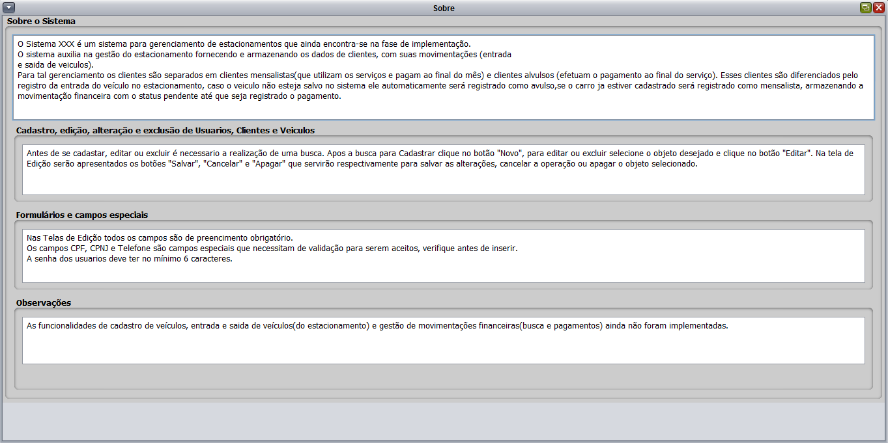
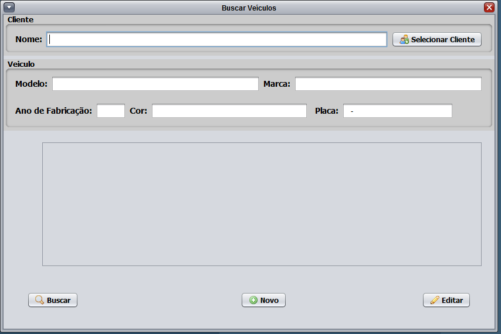

## Estacionamento

  <a href="#tecnologias">Tecnologias</a>&nbsp;&nbsp;&nbsp;|&nbsp;&nbsp;&nbsp;
  <a href="#-projeto">Projeto</a>&nbsp;&nbsp;&nbsp;

## Tecnologias

Esse projeto foi desenvolvido com as seguintes tecnologias:

- [Java](https://www.java.com/pt-BR/)
- [MySQL](https://www.mysql.com/)

## 💻 Projeto

Sistema para gerenciamento de estacionamentos proveniente de trabalho final da disciplina de Interface Homem Máquina contando com as seguintes funcionalidades: gestão de usuários, gestão de clientes, gestão de movimentações financeiras e gestão de entrada e saída de veículos. Este trabalho tinha como desafio o desenvolvimento de uma boa interface com base nas [Heurísticas de Nielsen](https://www.alura.com.br/artigos/10-heuristicas-de-nielsen-uma-formula-pra-evitar-erros-basicos-de-usabilidade?gclid=CjwKCAiA57D_BRAZEiwAZcfCxSsEwBjmuCTzl3z-fo9o7vqyMkSkxfFWQd8Yq9TwyJeIBHG3k-4FwhoCCcoQAvD_BwE).

<h1 align="center">
    
</h1>

<h1 align="center">
    
</h1>

<h1 align="center">
    
</h1>

